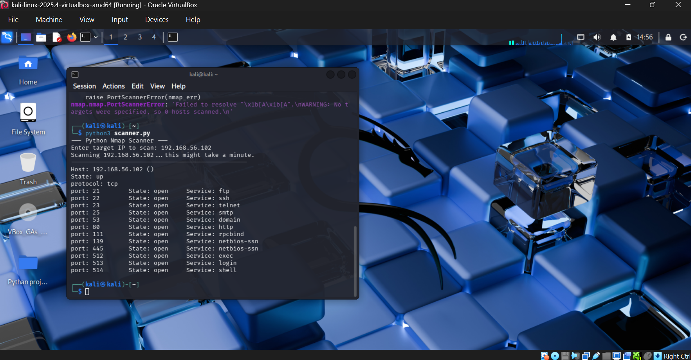

[scanner.py](https://github.com/user-attachments/files/24751640/scanner.py)
# Simple Network Scanner

## Objective
I built this tool to automatically identify open ports on a target computer (Metasploitable 2) within my home lab. The goal was to understand how network discovery works and how to automate it using Python.

## Tools Used
* **Python 3**
* **Nmap Library** (`python-nmap`)
* **VirtualBox** (for hosting the lab)
* **Kali Linux** (Attacker) & **Metasploitable 2** (Victim)

## The Process
I set up a virtual lab with an attacker machine and a vulnerable victim machine. I wrote a Python script that utilizes the Nmap library to scan specific IP addresses and report back the state of common ports (Open/Closed) and the service running on them.

## Challenges Faced
I initially encountered an issue where the scanner showed "0 ports found." I troubleshooted this by checking the network configurations and realized both VMs were on NAT. I fixed it by switching both network adapters to **Host-Only Mode**, which allowed the machines to communicate on a private network.

## Visuals

*(Make sure the filename matches exactly what you uploaded)*
